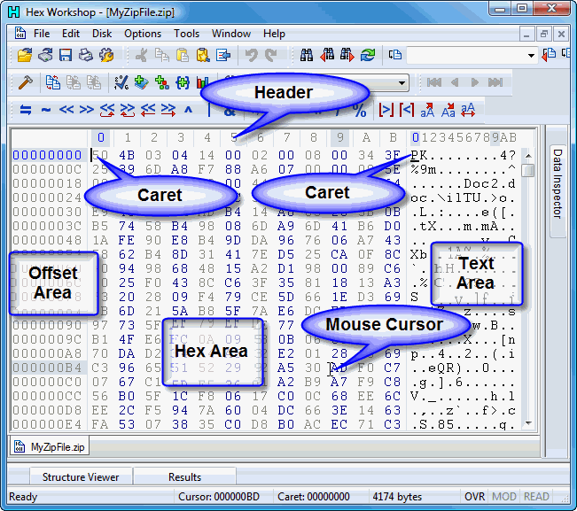

#### The Hex Workshop Editing Window includes 4 areas:
http://www.hexworkshop.com/onlinehelp/600/html/Editing_Files.htm

- Offset Header
- Offset Area
- Hex Area
- Text Area

###### Offset Header
The Offset Header shows the address offset of each of the columns for the Hex Area and Text Area.  When combined with the address from the Offset Area, users can quickly identify the address of a specific byte of data.

###### Caret Location Highlight
The Caret location is highlighted using the Offset Caret Highlight and shows the location of the editing caret.  In the example above, this is shown as blue on dark gray.

###### Mouse Location Highlight
The Mouse location is highlighted using the Offset Cursor Highlight and shows the location of the mouse cursor.  In the example above, this is shown as the default foreground color with a dark gray background.

###### Showing/Hiding the Offset Header
The offset header can be hidden through the General Display Options Preferences.

###### Clicking on Offset Header
Clicking on one of the offset labels adjust the caret position to that offset.  Only the column position of the caret is adjusted -- not the row.

###### Adjusting Address Width
The Address width (how many digits are displayed in the Offset Area) can be adjusted by dragging the separator between the Offset Area and Hex Area to the left or right.

